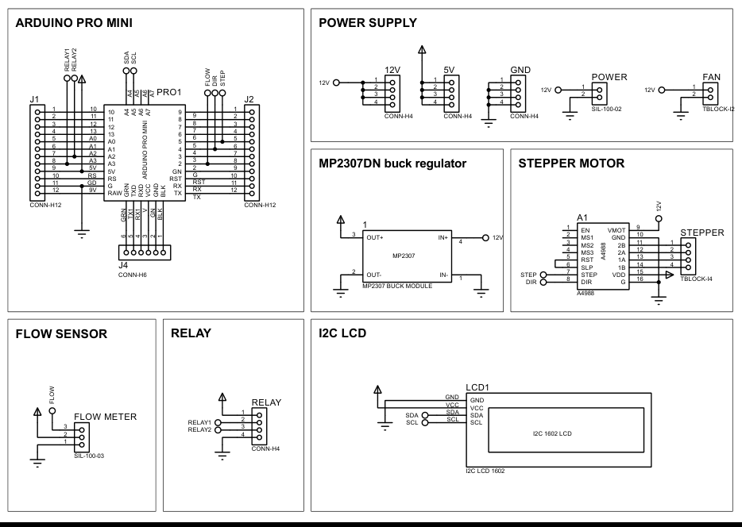
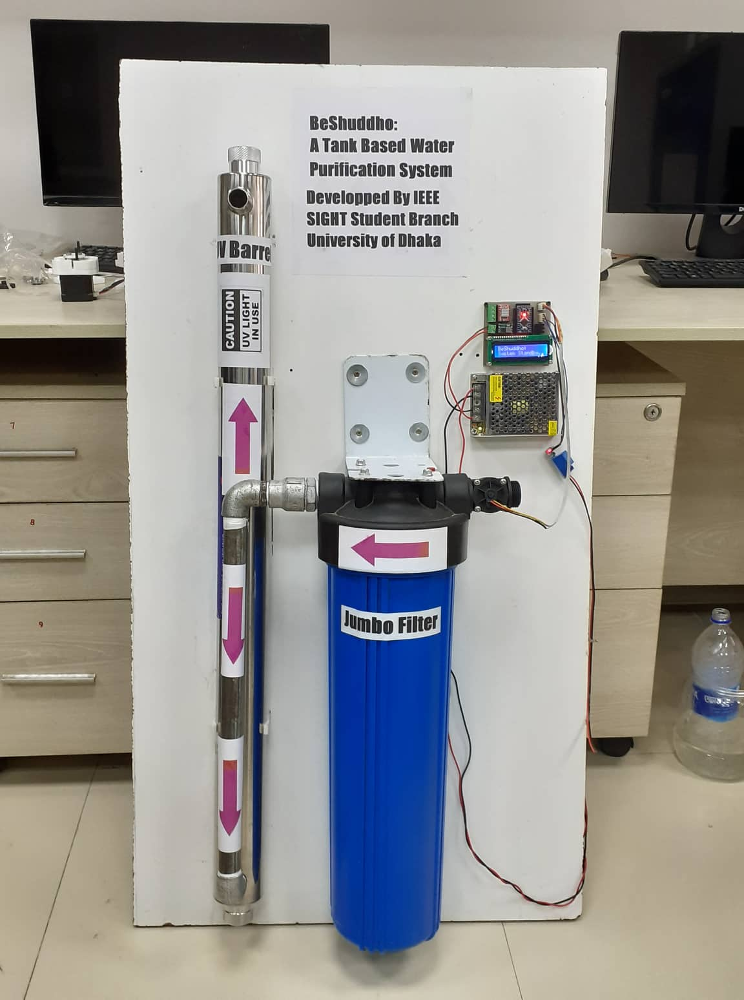
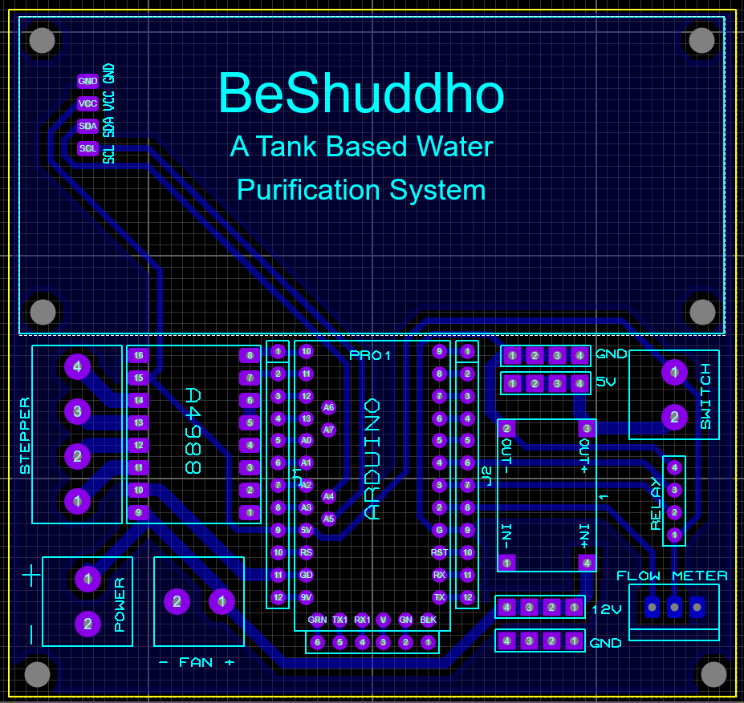
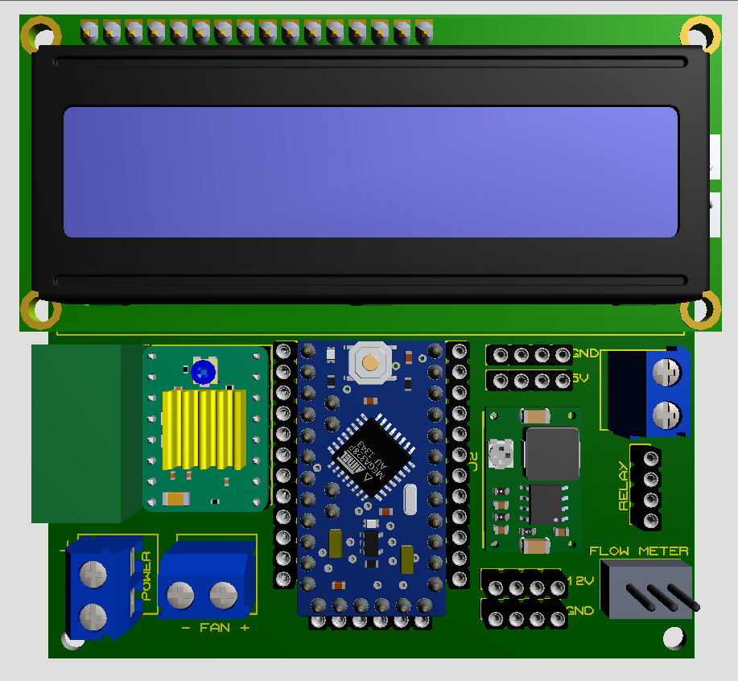

# BeShuddho
For the IEEE SIGHT funded project "BeShuddho: A Tank Based Water Purification System", all the materials, designs and code blocks are organized in this repository.
## 2021 IEEE HAC/SIGHT Projects - Focus on COVID-19 Response [& Pressing Community Need (CfP2)]
# Project Description

In such an unrestrainedly industrializing and densely populated country like Bangladesh, clean drinking
water is a scarcity. Due to the negligence of the relevant authorities in providing a safe water supply
Bangladeshi families usually resort to purifying water by themselves. A 2019 report by Transparency
International Bangladesh shows that 35% of people complained of foul smells and poor water quality. The
report further showed that 91% of people boil water before drinking, which is tedious and burns gas
equivalent to 332 crore BDT annually. In Doniya, a union inside Dhaka, Bangladesh the water supplied by the
WASA (Water Supply and Sewerage Authority) has so poor quality that most residents cannot use the water
for any drinking or cooking purposes. For drinking water, they have to rely on the nearest water pumping
station of WASA or any deep well water pump. Even that does not solve the exact problem, they use a water
purifier or boil the water before drinking to ensure water safety. Therefore, through this project, we propose
an affordable, automated water purification system with impurity-detecting sensors for the low-income 3
households of Bangladesh. The project "BeShuddho" is a system that will purify the WASA-supplied water
when it enters the rooftop water tanks for the whole house (3+ families). At first, the system detects incoming
water flow using sensors that trigger the purification system. The water must pass through a UV barrel that is
compatible with the incoming water flow. And a microcontroller-controlled system controls UV-barrel filteration.

# Product Design

# PCB Design

# Codes
see beshuddho.ino
